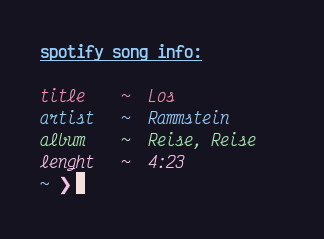

# sptfetch
minimal info fetch for spotify songs

### usage
- run the script to get info about the song
- it will use your currently playing spotify song

### dependencies:
- dbus-python (```pip3 install dbus-python```)

### installation:
if you use arch or arch based distro, use install script
```sh
curl https://github.com/okklol/sptfetch/blob/main/install.sh | bash
```

if you use another distro use:
```
pip3 install dbus-python
git clone https://github.com/okklol/sptfetch.git
sudo chmod +x ~/sptfetch/sptfetch
sudo mv ~/sptfetch/sptfetch /usr/bin/
```
